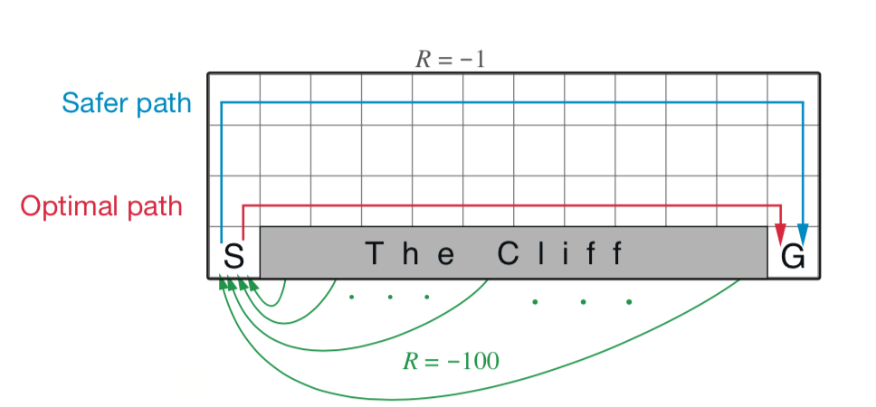

# Task 2 - MDPs and TD(0)

## Installation

```
$ conda install -c conda-forge gym
$ pip install gym-gridworlds
```

You can use the following link to install gym-gridworld: [here](https://github.com/podondra/gym-gridworlds). Should work right out of the box! Credits to the original repository. Feel free to use the #halp-desk discord channel if you need assistance!



## Instructions

For this coding challenge, you'll be implementing TD(0) and SARSA from the most recent lecture. In this environment, each step you take will have a -1 penalty and if you fall off the side of the cliff, you will recieve a -100 penalty. If you say go up when on the top row (or right on the right most column, etc) you will remain in your current state but still receive the -1 penalty. TD(0) uses a state value function V in order to compute the optimal path given a policy (in our case, our policy is to 25% of the time go up, right, left, or down). For SARSA, we will be using an action value function Q to compute the safest path from going from S to G in the image. Next week, we will be using Q-Learning to compute the Optimal Path.

In terms of coding, we have labeled "TODO"s as to where you need to code. There should be 2 blocks of code and 2 conceptual questions we ask at the end that you should fill out. A "convert_state_tuple" function is given to you that takes the arguments from the OpenAI Gym Environment which holds a (x.y) tuple and converts taht into a 1D flattened coordinate. Therefore, your state value function V in TD(0) will be a vector with size of the number of states (70) whereas the action value function Q in SARSA will be a matrix of size SxA (70x4). The bottom half-ish of the code is a way for the code to traverse the optimal path that you created starting from position 1 and going to the goal. If the code gets stuck there, it's likely your value function is getting stuck in a loop (ex: the value states to go up on a state but then the next value states to go down).

You will have a peer for this assignment. If you do not have a peer (after 24 hours of the lecture have passed) or run into any issues, please reach out to one of the officers and we shall assist. Though you have a peer, please feel free to talk to other groups and discuss what others have come up with.

Important note: for this assignment, there's no "grading" per se, so just try your best! You may need to tune the hyperparameters (~fancy~ word for epsilon, step size, discount rate, and other constants) in order to replicate the results, but feel free to mess around with things and no worries if you can't get things exact!

Best wishes! :)))
